<picture>
  
</picture>

<a href="./README.md">Ler em português</a>

Full-Stack Software Engineer experienced with TypeScript, React, Next.js, Node.js, C#, .NET, and PostgreSQL. I build applications across front end and back end, turning ideas into simple, scalable solutions focused on the user experience.

[Portfolio](https://achtenberg-rafael.vercel.app/) · [LinkedIn](https://www.linkedin.com/in/achtenrafael/) · [Email](mailto:achtenberg.rafa@gmail.com)

## Technologies

<picture>
  
</picture>
