<picture>
  
</picture>

<a href="./README.en.md">Read in English</a>

Desenvolvedor Full Stack com experiência em TypeScript, React, Next.js, Node.js, C#, .NET e PostgreSQL. Desenvolvo aplicações do front-end ao back-end, transformando ideias em soluções simples, escaláveis e focadas na experiência do usuário.

  
  
  

## Tecnologias

<picture>
  
</picture>
